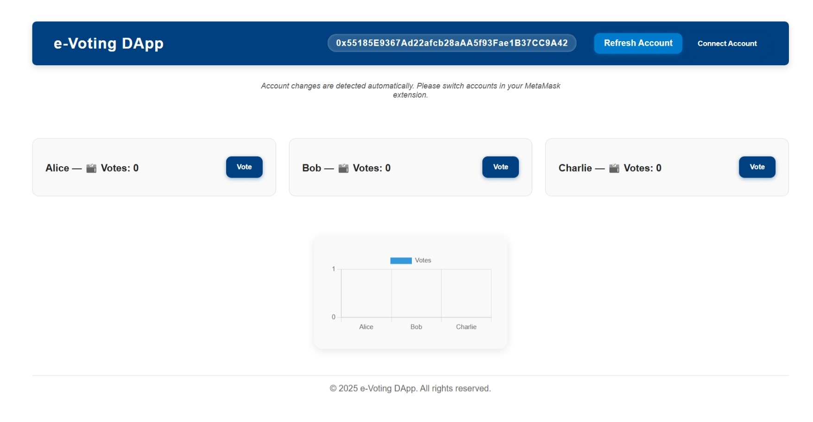
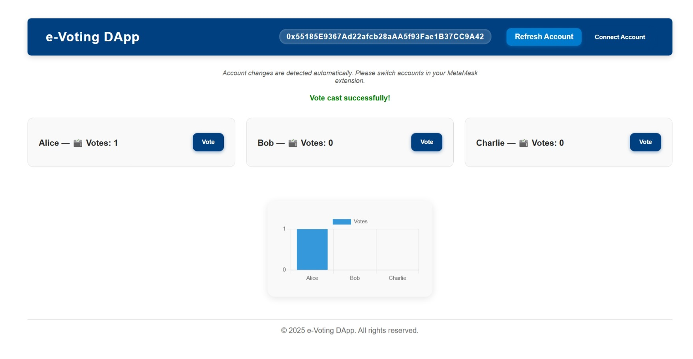
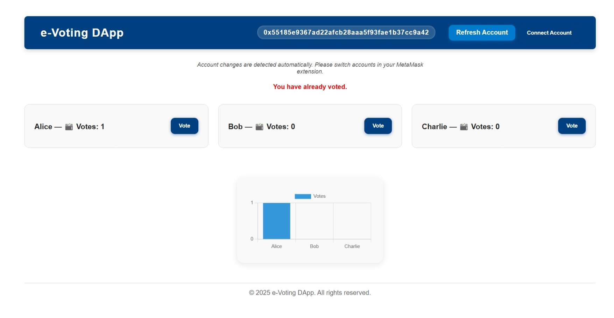
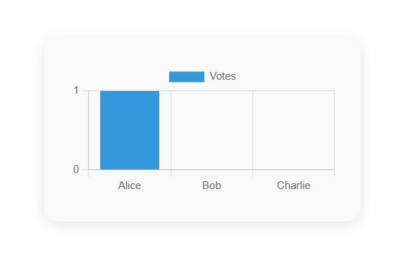

🗳️ Blockchain Voting DApp

A decentralized voting application built with **Solidity**, **Web3.js**, and **Chart.js**. Users can vote securely on the Ethereum blockchain with real-time result visualization.

 🚀 Features
  
- 🧑‍⚖️ One vote per account (prevents double voting)  
- 🔄 Resettable election by owner  
- 📊 Live vote visualization using Chart.js  
- 🦊 MetaMask integration  
- 📋 Dynamic candidate list  


 🧱 Tech Stack

- **Solidity** – Smart contract language  
- **Web3.js** – Interact with Ethereum blockchain  
- **Chart.js** – Frontend chart rendering  
- **Truffle** – Smart contract development framework  
- **Ganache** – Local Ethereum blockchain  
- **MetaMask** – Wallet for voting interaction  

📂 Project Structure

voting-dapp/

├── contracts/

│ └── Voting.sol

├── migrations/

│ └── 2_deploy_contracts.js

├── src/

│ ├── index.html

│ ├── app.js

│ └── chart.js

├── truffle-config.js

└── README.md

### Prerequisites

- [Node.js](https://nodejs.org/) (Version: **v18.x.x**)
- [Truffle](https://trufflesuite.com/)
- [Ganache](https://trufflesuite.com/ganache/)
- [MetaMask](https://metamask.io/)


 🛠️ Installation Steps

 1. Clone the Repository
```bash
git clone https://github.com/your-username/voting-dapp.git
cd voting-dapp
```
2. Install Dependencies
 ```bash
npm install
```
3. Start Ganache
If using Ganache GUI, just open it and start a workspace.
For CLI users:
```bash
ganache-cli
```
4. Compile & Migrate Smart Contracts
```bash
truffle compile
truffle migrate --reset
```
⚠️ Ensure MetaMask is connected to your Ganache network (default: http://127.0.0.1:7545).
---

5. Run the Frontend with live-server
Navigate to the directory where your index.html is located (usually in src or root) and run:
```bash
live-server
```
This will automatically open the frontend in your browser at http://127.0.0.1:8080 (default).

## 📩 Smart Contract Integration

After deploying your contract, you'll get two important things:

1. ✅ **Contract Address** – shown after deployment in the terminal (e.g., `0xAbc123...`)
2. ✅ **Contract ABI** – found in `build/contracts/Voting.json`

### 🔧 Paste into Frontend

Open your frontend JavaScript (usually `index.js` or `app.js`) and update these:

```javascript
const contractAddress = "PASTE_YOUR_DEPLOYED_ADDRESS_HERE";

const contractABI = [ /* Copy from Voting.json ABI section */ ];
```

📊 Live Chart with Chart.js
Votes are visualized using a real-time bar chart powered by Chart.js. It updates automatically as users vote via Web3.
---

## 🖼️ Screenshots

### 🏠 Homepage (DApp Landing)



---

### ✅ Voting Success Message



---
### ⚠️ Already Voted Alert



### 📊 Live Vote Count Chart



## 🧑‍💻 About Me

- 👨‍💻 **Chandan B**
- 🔗 [LinkedIn](https://www.linkedin.com/in/chandan-b-2950a626a)
- 💻 [GitHub](https://github.com/Chandu-0604)
- 📧 [Email Me](mailto:chandu.62004@gmail.com)


